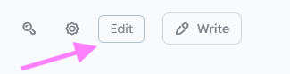
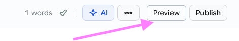

# Hashnode QoL Enhancer

A tiny userscript that makes writing on Hashnode a bit easier by adding two simple buttons.

What it does
- Preview button: When you're editing a draft on Hashnode, a "Preview" button appears next to the editor controls and opens a preview of your draft on your blog.
- Edit button: When you view a post on your personal `*.hashnode.dev` blog, an "Edit" button appears and takes you straight to the Hashnode post editor.

What the buttons look like

How to use (quick and easy)
1. Install a userscript manager in your browser (Tampermonkey or Greasemonkey).
2. In the manager, create a new script and paste the contents of `script.js` from this folder, or use the raw file URL so the manager can auto-update the script.
3. Make sure the script is enabled and allowed to run on `hashnode.com` and `*.hashnode.dev`.
4. Open a draft at `https://hashnode.com/draft/<your-id>` to see the Preview button, or open one of your `*.hashnode.dev` posts to see the Edit button.

Tips & troubleshooting
- Buttons won't show if the script is disabled or blocked by your userscript manager—check the manager's toolbar icon.
- The Preview button needs Hashnode's editor to have stored the blog reference in your browser; if it can't find that, it will show a short alert instead of opening a preview.
- If the Edit button doesn't work, the script couldn't find the post identifier on that page—try opening the post page in a normal browser tab (not a preview) and try again.

Why this exists
The script is meant to save a couple of clicks for people who write on Hashnode frequently—no tracking, no extra permissions, just small convenience buttons.

Need help or want to report an issue?
- Open an issue in this repository with a short description and a link to the page where the buttons didn't appear.

License
See the `LICENSE` file at the repository root.
